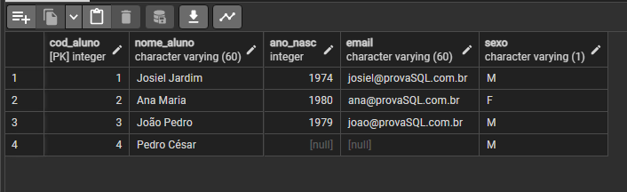
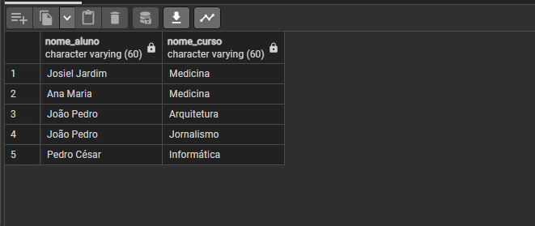
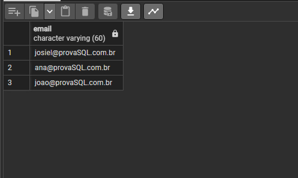
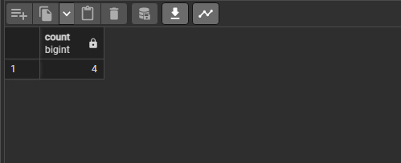
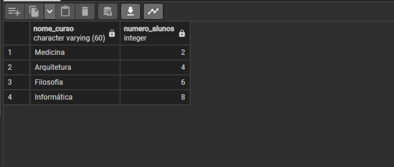
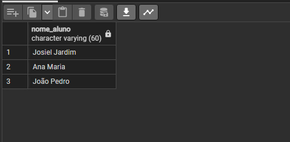

### <b><h1 align="center"> Prova Prática de Banco de Dados SQL</h1></b>
<h4>PROFESSOR: Adeilson Sales Aragão </h4>
<h2 align="center"><i> Mikael Diogo Ferreira  | Nº28 | 2º Infórmática </h2>


<h1>Prova de banco de dados</h1>
Neste repositório será mostrado passo a passo a criação do banco de dados, das tabelas, suas devidas inserções e a resolução de cada questão
<h2>Criação do banco</h2>

```
CREATE DATABASE bdescola
```
<h2>Criação das tabelas</h2>
Criando a tabela 'tb_aluno'


```
CREATE TABLE tb_aluno( 
codigo_aluno INTEGER PRIMARY KEY, 
nome_aluno VARCHAR(60) NOT NULL, 
ano_nascimento INT, 
email VARCHAR(60), 
sexo VARCHAR NOT NULL
)  
```


Criando a tabela 'tb_curso'
```
CREATE TABLE tb_curso( 
codigo_curso INTEGER PRIMARY KEY, 
nome_curso VARCHAR(60) NOT NULL 
) 
```
Criando a tabela 'tb_matricula'
```
CREATE TABLE tb_matricula( 
codigo_curso INTEGER REFERENCES tb_curso (codigo_curso), 
codigo_aluno INTEGER REFERENCES tb_aluno (codigo_aluno) 
) 

alter table  
add constraint fk_codigo_curso foreign  key (codigo_curso) references tb_curso(codigo_curso) 
add constraint fk_codigo_aluno foreign  key (codigo_aluno) references tb_aluno(codigo_aluno)

```


<h2>Inserção dos dados</h2>

Inserindo dados na tabela 'tb_curso'

```
INSERT INTO tb_curso (codigo_curso, nome_curso) 
VALUES (1, ‘MEDICINA’) 
```


Inserindo dados na tabela 'tb_matricula

```
INSERT INTO tb_matricula (codigo_curso, codigo_aluno)  
VALUES (1, 1) 
```


Inserindo dados na tabela 'tb_aluno'

```
INSERT INTO tb_aluno (codigo_aluno, nome_aluno, ano_nascimento, email, sexo) 
VALUES (3, 'João Pedro', '1979', 'joao@provasql.com.br', 'M') 
```

  <h2>Resolução das questões</h2>
  
  <h3>Questão 01</h3>
    
  <h4>Faça um comando SQL para matricular o aluno “Pedro César” no curso de
Informática. Os dados devem ser inseridos na tabela TB_MATRÍCULA.</h4>

<div align="center">
  
</div>

```
insert into tb_aluno(cod_aluno,nome_aluno,ano_nasc,email,sexo)
values(4, 'Pedro César', NULL, null,'M');
insert into tb_matricula(cod_curso, cod_aluno)
values(4, 4)
    
```
  <h2> Question 2 </h2>
  
<h4>Escreva um comando SQL que retorne os nomes dos alunos e do(s) cursos em
que estão matriculados. Os dados deverão estar ordenados pelo nome do curso.</h4>

<div align="center">
  
</div>

```0
select tb_aluno.nome_aluno, tb_curso.nome_curso from tb_aluno 
inner join tb_matricula on tb_aluno.codigo_aluno = tb_matricula.codigo_aluno
inner join tb_curso on tb_curso.codigo_curso = tb_matricula.codigo_curso
```

<h2> Question 3 </h2>

<h4>Crie um comando SQL que retorne o e-mail de todos os alunos maiores de idade.</h4>

<div align="center">
  
</div>

```
select email from tb_aluno where 2022 - ano_nascimento >= 18
```

<h2> Question 4 </h2>

<h4>Desenvolva um comando SQL que mostre o total de alunos.</h4>

<div align="center">
  
</div>

```
select count(cod_aluno) as totalalunos from tb_aluno
```

<h2> Question 5 </h2>

<h4>Desenvolva um comando SQL que mostre o total de alunos.</h4>

<div align="center">
  
</div>

```
alter table tb_matricula
add column codigo_matricula int primary key on update cascade
```

```
select count(codigo_matricula) from tb_matricula
```

<h2> Question 6 </h2>
<h4>Desenvolva um comando SQL que retorne o nome de todos os alunos maiores que
18 anos.</h4>

<div align="center">
  
</div>

```
select nome_aluno from tb_aluno where 2022 - ano_nascimento >= 18
```
