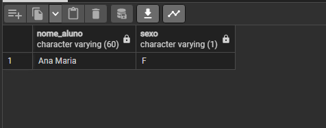
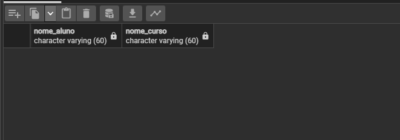
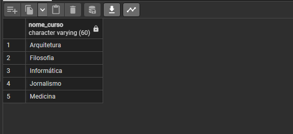
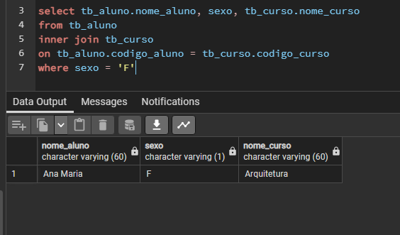

### <b><h1 align="center"> Prova Prática de Banco de Dados SQL</h1></b>
<h4>PROFESSOR: Adeilson Sales Aragão </h4>
<h2 align="center"><i> Mikael Diogo Ferreira  | Nº28 | 2º Infórmática </h2>


<h1>Prova de banco de dados</h1>
Neste repositório será mostrado passo a passo a criação do banco de dados, das tabelas, suas devidas inserções e a resolução de cada questão
<h2>Criação do banco</h2>

```
CREATE DATABASE DataBaseSchool
```
<h2>Criação das tabelas</h2>
Criando a tabela 'tb_aluno'


```

create table tb_aluno (
	cod_aluno int primary key,
	nome_aluno varchar(60) not null,
	ano_nasc int,
	email varchar(60),
	sexo varchar(1) not null
)
```


Criando a tabela 'tb_curso'
```
create table tb_curso(
	cod_curso int primary key,
	nome_curso varchar(60) not null
)
```
Criando a tabela 'tb_matricula'
```
create table tb_matricula(
	cod_curso int references tb_curso(cod_curso),
	cod_aluno int references tb_aluno(cod_aluno)
)


```


<h2>Inserção dos dados</h2>

Inserindo dados na tabela 'tb_curso'

```
insert into tb_curso(cod_curso, nome_curso)
values(1, 'Medicina')
values(2, 'Arquitetura')
values(3, 'Filosofia')
values(4, 'Informática')
values(5, 'Jornalismo')
 
```


Inserindo dados na tabela 'tb_matricula

```
create table tb_matricula(
	cod_curso int references tb_curso(cod_curso),
	cod_aluno int references tb_aluno(cod_aluno)
)
```


Inserindo dados na tabela 'tb_aluno'

```
insert into tb_aluno(cod_aluno,nome_aluno,ano_nasc,email,sexo)
values(1, 'Josiel Jardim', '1974','josiel@provaSQL.com.br','M');
values(2, 'Ana Maria', '1980','ana@provaSQL.com.br','F');
values(3, 'João Pedro', '1979','joao@provaSQL.com.br','M');
```

  <h2>Resolução das questões</h2>
  
  <h3>Questão 01</h3>
    
  <h4>Faça um comando SQL para matricular o aluno “Pedro César” no curso de
Informática. Os dados devem ser inseridos na tabela TB_MATRÍCULA.</h4>


  


```
insert into tb_aluno(cod_aluno,nome_aluno,ano_nasc,email,sexo)
values(4, 'Pedro César', NULL, NULL,'M');
insert into tb_matricula(cod_curso, cod_aluno)
values(4, 4)
    
```
  <h2> Questão 02 </h2>
  
<h4>Escreva um comando SQL que retorne os nomes dos alunos e do(s) cursos em
que estão matriculados. Os dados deverão estar ordenados pelo nome do curso.</h4>


  

```
  select tb_aluno.nome_aluno, tb_curso.nome_curso FROM tb_aluno
INNER JOIN tb_matricula
ON tb_aluno.cod_aluno = tb_matricula.cod_aluno
INNER JOIN tb_curso
ON tb_curso.cod_curso = tb_matricula.cod_curso
```

<h2> Questão 03 </h2>

<h4>Crie um comando SQL que retorne o e-mail de todos os alunos maiores de idade.</h4>

  


```
select email from tb_aluno where 2022 - ano_nasc >= 18
```

<h2> Question 04 </h2>

<h4>Desenvolva um comando SQL que mostre o total de alunos.</h4>


  


```
select count(cod_aluno) from tb_aluno 
```

<h2> Questão 05 </h2>

<h4>Desenvolva um comando SQL que mostre o total de alunos.</h4>

  


```
select tb_curso.nome_curso,
cod_curso + cod_aluno as numero_alunos 
from tb_curso
inner join tb_aluno
on tb_aluno.cod_aluno = tb_curso.cod_curso
```


<h2> Questão 06 </h2>
<h4>Desenvolva um comando SQL que retorne o nome de todos os alunos maiores que
18 anos.</h4>

  


```
select nome_aluno from tb_aluno where 2022 - ano_nasc >= 18 
```

  
 <h2>Questão 07</h2>
 <h4>Faça um comando SQL que retorne o nome de todas as mulheres.</h4>
	
 
	
```
select nome_aluno, sexo
from tb_aluno where sexo = 'F'
 ```
 
<h2>Questão 08</h4>

<h4>Faça um comando SQL que retorne o nome de todas as mulheres matriculadas no curso de Medicina.</h4>

 
 
 ```
select tb_aluno.nome_aluno, tb_curso.nome_curso
from tb_aluno
inner join tb_curso
on tb_aluno.cod_aluno = tb_curso.cod_curso
where nome_curso = 'Medicina' and sexo = 'F'
 
 ```
 
 <h2>Questão 09</h2>
 
 <h4>Faça um comando SQL que retorne os nomes dos cursos ordenados por ordem alfabética.</h4>
 
 
 
 ```
select nome_curso
from tb_curso order by nome_curso ascina' and sexo = 'F'
 
 ```
 
 <h2>Questão 10</h2>
 
 <h4>Crie o enunciado de uma consulta SQL que utilize “junção” (como resposta) </h4>
 Mostre os nomes de todas as alunas do curso de arquitetura e seu respectivo sexo.
 
 
  
  
 ```
select tb_aluno.nome_aluno, sexo, tb_curso.nome_curso
from tb_aluno
inner join tb_curso
on tb_aluno.codigo_aluno = tb_curso.codigo_curso
where sexo = 'F'
 ```
	
 
<h2>Questões Teóricas</h2>
<h3>01 Defina SQL:</h3>
	

SQL é uma linguagem padrão para trabalhar com bancos de dados relacionais. Ela é uma linguagem declarativa e que não necessita de profundos conhecimentos de programação para que alguém possa começar a escrever queries, as consultas e pedidps, que trazem resultados de acordo com o que você está buscando.

<h3>02 Faça um relacionamento cronológico sobre SQL</h3>
	
 O SQL foi originalmente desenvolvido  no início dos anos 1970 no IBM Labs. O nome original da linguagem era SEQUEL, 
, que significa "Structured English Query Language". No início dos anos 1980, o American National Standards Institute (ANSI) começou  a trabalhar no desenvolvimento de uma versão padrão do SQL que foi publicada em 1986 e 1
. Desde então, o SQL passou por 
.
 melhorias importantes e outras alterações e adições até os dias atuais. . até agora, tornou-se a linguagem  padrão para bancos de dados.
	
<h3>03 Liste as principais caracteríticas de SQL</h3>
Trata-se de uma linguagem com palavras-chave em inglês, e formato livre (com relação à identificação, quebra de linhas, etc.) e livremente baseada na Teoria dos Conjuntos, isto é, as tabelas onde constam as informações são tratadas como conjuntos, onde são aplicadas operações de intercessão, união, seleção, etc.
Suas principais funções:

Analíticas: Computam um valor agregado com base em um grupo de linhas. Podemos usar funções analíticas para calcular médias móveis, totais acumulados, percentuais ou os primeiros N resultados de um grupo.

Manipulação de bits: permitem processar e armazenar dados com mais eficiência do que com bits individuais.

Classificação: Retornam um valor de classificação para cada linha em uma partição. Dependendo da função usada, algumas linhas podem receber o mesmo valor que outras.

Conjunto de linhas: Retornam um objeto que pode ser usado como referências de tabela em uma instrução SQL.

Escalares: Funcionam em um valor único e retornam um valor único. As funções escalares podem ser usadas onde uma expressão é válida.
	
<h3>04 Descreva a sintaxe do comando SQL: SELECT. Quais cláusulas são obrigatórias e quais são opcionais?</h3>
O comando SELECT é utilizado para extrair os dados das tabelas de um banco de dados. Ele pode extrair dados de uma ou mais tabelas ao mesmo tempo, executando desde simples consultas até comandos mais complexos, fazendo buscas, junções, filtros comparativos, ordenações e diversos outros itens. As principais cláusulas são:
FROM: Especifica as tabelas ou consultas que contêm os campos listados na instrução SELECT.

WHERE: A cláusula WHERE é a responsável por filtrar resultados, utilizando parâmetros comparativos como igual, diferente, maior, menor e entre outros. Além disso, podemos usar diversos filtros em nossas consultas, inclusive adicionar parênteses para priorizar consultas dentro de escopos.

ORDER BY: Serve para ordenar os resultados com a cláusula ORDER BY. A cláusula ORDER BY deve ser inserida após as cláusulas anteriores. O modo ascendente (ASC) é o padrão do ORDER BY, indo do menor para o maior. Porém, contém também o modo decrescente (DESC), indo do maior para o menor.
	
	
<h3>05 Qual a importância da linguagem SQL no desenvolvimento de softwares atualmente? Justifique</h3>
O SQL é bem importante no desenvolvimento de softwares, já que as consultas e o gerenciamento de dados se tornam bem mais dinâmicas. Aprendê-la permite entrar em contato com os dados na fonte e é uma linguagem bem simples de se aprender.
	
	
	
